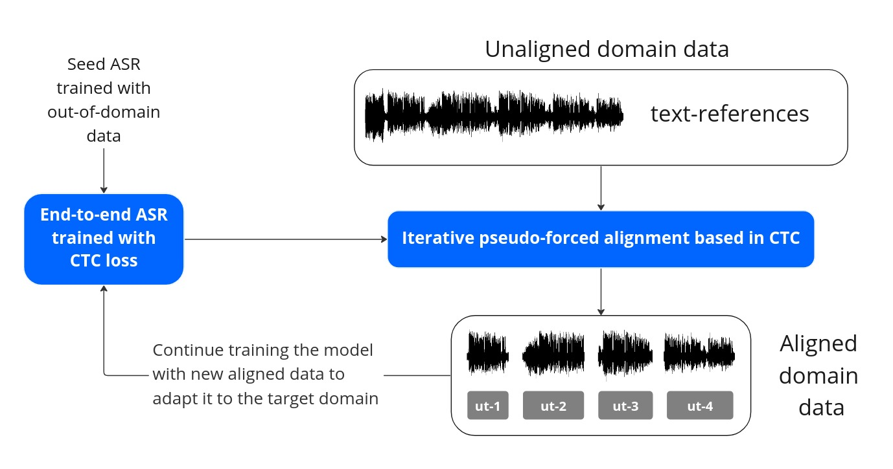
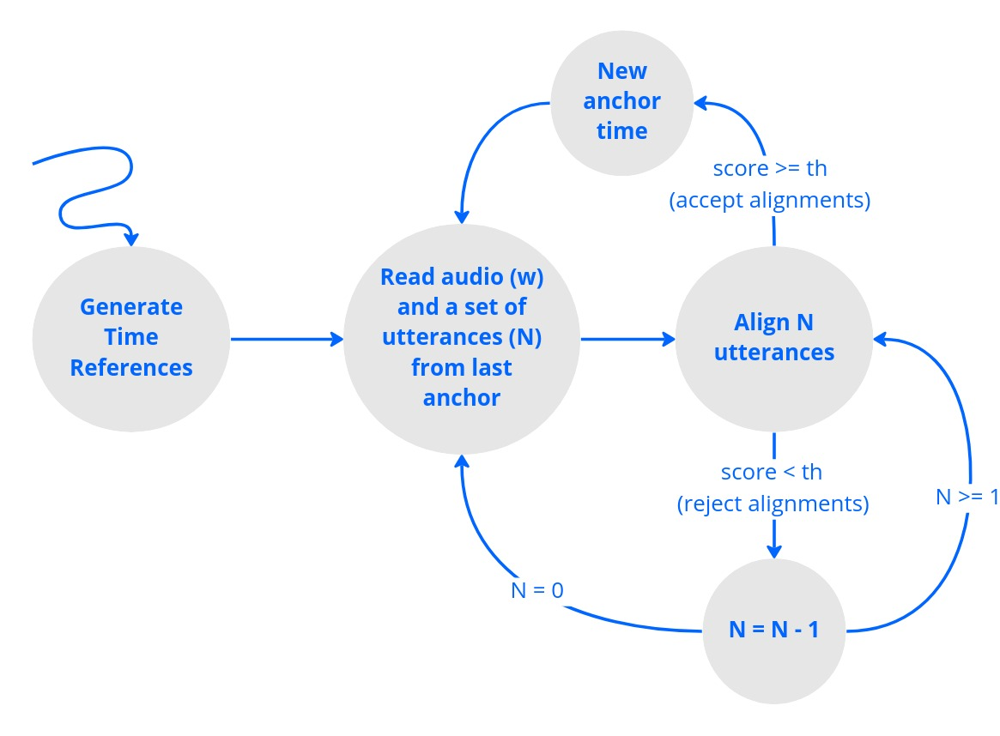

# Iterative pseudo-forced alignment by acoustic CTC loss for self-supervised ASR domain adaptation

This repository contains the code for the publication available on [ArXiv](https://arxiv.org/abs/2210.15226). It performs audio-to-text alignment using an iterative anchor-based approach. It was originally proposed for self-supervised ASR domain adaptation, but it supports three distinct tasks:
- **Utterance-level alignment**: timestamps are assigned to utterances even with low-quality text references (e.g. YouTube closed-captions).
- **Word-level alignment**: given an utterance-aligned dataset, specific words or phrases are located within each utterance.
- **Search on speech**: given untranscribed speech segments (e.g. VAD output), a specific word is searched across all segments by confidence-filtered forced alignment.

The code requires a pre-trained SpeechBrain `EncoderASR` model. Alignment quality depends on ASR accuracy — CTC spikes are not always precisely placed — so character-level acoustic models produce the best results.


## ASR self-supervised domain-adaptation scheme
When it comes to medium and low-resource languages, the maximum exploitation of data is sought, given that manual annotations are costly and time-consuming. A common technique is to retrieve audio-to-text alignments from available audio data that has text references (e.g. from the internet). The ASR self-supervised domain adaptation scheme is presented in the following diagram:


The utterance-level alignments produced with this repository can be used to continue training the seed ASR and therefore adapting it to a target domain.

## Environment setup

Python 3.10 or 3.11 is required. Create a virtual environment and install dependencies:

```bash
python3 -m venv .venv
source .venv/bin/activate

# Install PyTorch with CUDA support first (adjust cu124 to match your driver)
pip install torch torchaudio --index-url https://download.pytorch.org/whl/cu124

# Pin numpy below 2.x before building ctc-segmentation (its Cython extension
# is compiled against numpy 1.x)
pip install "numpy<2"

# Install ctc-segmentation from source so it compiles against the pinned numpy
pip install ctc-segmentation --no-binary ctc-segmentation --no-deps

# Install the remaining dependencies
pip install -r requirements.txt
```

> **Note:** `requirements.txt` lists `torch` and `torchaudio` without a CUDA
> suffix so that the file stays portable. The explicit `--index-url` step above
> is what pulls the GPU-enabled wheels. `huggingface-hub` is capped at `<0.36`
> because `speechbrain==0.5.16` uses an argument removed in that release.

## Usage

Sample data and scripts are provided for aligning a YouTube video. Follow [**data/sample/README.md**](data/sample/README.md) to download the audio before running any of the scripts below.

<details><summary><strong>Utterance-level alignments</strong></summary><div>

The bash script <strong>align_utterances.sh</strong> is provided as example to perform audio-to-text alignments of long audio files using text references from Youtube.

Basic configuration of the alignment script is presented next:

```bash
alignment_name="benedetti" # alignment name, comment to use timestamp instead
tsv_path=data/sample/tsv/benedetti.tsv # source file with metadata
merge_files=true # merge aligned files in a single tsv
generate_vad_segments=true # put to false if already generated
generate_stm_results=true # generate stm files from tsv results
n_process=1 # number of processes to perform alignment, numbers bigger than 1 perform parallel alignment
```
</div></details>

<details><summary><strong>Word-level alignments</strong></summary><div>
The bash script <strong>align_words.sh</strong> is provided as example to perform audio-to-text alignments words that appear in the transcription of utterances. The file <strong>config/words.json</strong> must contain the wanted words. The process is done as follows: 
<ul>
  <li>Filter transcriptions that contain the wanted text configured in words.json</li>
  <li>Force-align the wanted text in all utterances.</li>
  <li>Filter alignments by confidence.</li>
</ul>


In this example, the search targets "mi amor". The `words` field is an array, so multiple phrases can be aligned in one run.

```json
{
    "words": ["mi amor"]
}
```
Basic configuration of the alignment script is presented next:

```bash
config_file=config/words.json # json config file: contains an array with the wanted words
alignment_name="benedetti_words" # alignment name, comment to use timestamp instead
tsv_path=data/wip_benedetti/results/benedetti_aligned.tsv # source file with metadata
text_column="Transcription" # column name in tsv that contains the utterance text reference
```

</div></details>

<details><summary><strong>Search on speech</strong></summary><div>
Use this mode only when you have reason to believe the audio contains the target word. The process is:
<ul>
  <li>Force-align the target text against every utterance. Most segments will not contain it, so most alignments will be invalid.</li>
  <li>Filter by confidence score with a strict threshold. A value above -1.0 (log-probability) is recommended.</li>
</ul>

As example, we provide the bash script <strong>search_on_speech.sh</strong> where you should configure source speech and wanted text:
```bash
# config zone
alignment_name="benedetti_sos" # alignment name, comment to use timestamp instead
tsv_path=data/wip_benedetti/results/benedetti_aligned.tsv # source file with metadata
speech_to_search="solo" # text that will be searched in all segments
```
</div></details>


## How the iterative pseudo-forced alignment approach works

1. Pre-process audio with a Voice Activity Detector (VAD), removing only non-speech segments longer than a given length.
2. Split the reference text in utterances with a maximum length of words.
3. Calculate initial time references based on total text length and total speech time. We assign an audio duration proportional
to text length. This assumes constant speech velocity but is only used to have initial time references.
4. Read audio and utterances from the last temporal anchor point. In the first step, the previous anchor point is defined by the first voice event in the audio file. As the algorithm progresses, new anchor points will be defined by the accepted alignments.
5. Perform iterative alignments with a fixed quantity of audio and a variable amount of text.



## Citations

```bibtex
@article{lopez2022tid,
  title={TID Spanish ASR system for the Albayzin 2022 Speech-to-Text Transcription Challenge},
  author={L{\'o}pez, Fernando and Luque, Jordi},
  journal={Proc. IberSPEECH 2022},
  pages={271--275},
  year={2022}
}

@misc{https://doi.org/10.48550/arxiv.2210.15226,
  doi = {10.48550/ARXIV.2210.15226},
  url = {https://arxiv.org/abs/2210.15226},
  author = {López, Fernando and Luque, Jordi},
  title = {Iterative pseudo-forced alignment by acoustic CTC loss for self-supervised ASR domain adaptation},
  publisher = {arXiv},
  year = {2022},
  copyright = {Creative Commons Attribution 4.0 International}
}

```
