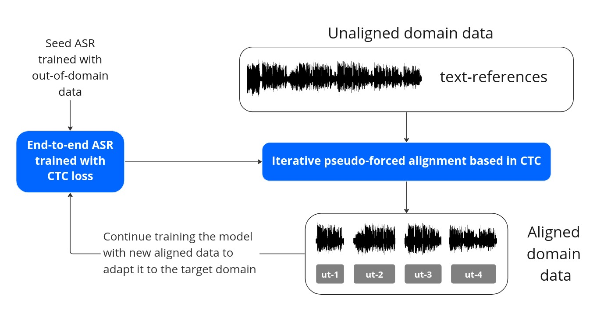

# Iterative pseudo-forced alignment by acoustic CTC loss for self-supervised ASR domain adaptation

This repo contains the code for the publication available on [ArXiv](https://arxiv.org/abs/2210.15226). It allows us to perform audio-to-text alignments using an iterative approach based on anchors. It was originally proposed to perform self-supervised ASR domain adaptation, but it can be used for the following tasks:
- **Utterance-level alignments**: even with low-quality text references (e.g. Youtube closed-captions).
- **Word-level alignments**: when having a dataset that is utterance-level aligned, you will be able to search word apparitions.
- **Search on speech**: when having utterances (e.g. VAD segments) without any text reference, we can search for the occurrence of words.

Note that this code depends on an already trained ASR with the SpeechBrain framework, concretely an EncoderASR. The quality of the alignments will vary depending on the ASR performance (as known the CTC spikes are not always accurate). The best approach is to use an acoustic ASR that classifies characters.


## ASR self-supervised domain-adaptation scheme
When it comes to medium and low-resource languages, the maximum exploitation of data is sought, given that manual annotations are costly and time-consuming. A common technique is to retrieve audio-to-text alignments from available audio data that has text references (e.g. from the internet). The ASR self-supervised domain adaptation scheme is presented in the following diagram:


The utterance-level alignments produced with this repository can be used to continue training the seed ASR and therefore adapting it to a target domain.

## Environment setup

Create a virtual environment and install dependences by running the next lines:

``` bash
# create a virtual environment
python3 -m venv .venv
# activate the virtual environment
source .venv/bin/activate
# install dependencies
pip install -r requirements.txt
```

## Usage

We provide sample data and scripts to perfrom long audio files alignments from Youtube videos. Additionally, we provide the code to search word apparitions when we have text references and when we do not have it. The first step is to follow the instructions from [**data/sample/README.md**](data/sample/README.md) instructions to get the sample data.

<details><summary><strong>Utterance-level alignments</strong></summary><div>

The bash script <strong>align_utterances.sh</strong> is provided as example to perform audio-to-text alignments of long audio files using text references from Youtube.

Basic configuration of the alignment script is presented next:

```bash
alignment_name="benedetti" # alignment name, comment to use timestamp instead
tsv_path=data/sample/tsv/benedetti.tsv # source file with metadata
merge_files=true # merge aligned files in a single tsv
generate_vad_segments=true # put to false if already generated
generate_stm_results=true # generate stm files from tsv results
n_process=1 # number of processes to perform alignment, numbers bigger than 1 perform parallel alignment
```
</div></details>

<details><summary><strong>Word-level alignments</strong></summary><div>
The bash script <strong>align_words.sh</strong> is provided as example to perform audio-to-text alignments words that appear in the transcription of utterances. The file <strong>config/words.json</strong> must contain the wanted words. The process is done as follows: 
<ul>
  <li>Filter transcriptions that contain the wanted text configured in words.json</li>
  <li>Force-align the wanted text in all utterances.</li>
  <li>Filter alignments by confidence.</li>
</ul>


In this case, we will look for "mi amor" occurences. As it is an array, many words can be aligned.

```json
{
    "words": ["mi amor"]
}
```
Basic configuration of the alignment script is presented next:

```bash
config_file=config/words.json # json config file: contains an array with the wanted words
alignment_name="benedetti_words" # alignment name, comment to use timestamp instead
tsv_path=data/wip_benedetti/results/benedetti_aligned.tsv # source file with metadata
text_column="Transcription" # column name in tsv that contains the utterance text reference
```

</div></details>

<details><summary><strong>Search on speech</strong></summary><div>
This is not recommended unless you are sure that the spoken contains the wanted word. The process to retrieve the words is as follows:
<ul>
  <li>Force-align the wanted text in all utterances. As many utterances may not contain the wanted text, we will produce non-valid alignments.</li>
  <li>Filter alignments by confidence score beeing restictive. A value bigger than -1.0 (log-probabilities) is recommended.</li>
</ul>

As example, we provide the bash script <strong>search_on_speech.sh</strong> where you should configure source speech and wanted text:
```bash
# config zone
alignment_name="benedetti_sos" # alignment name, comment to use timestamp instead
tsv_path=data/wip_benedetti/results/benedetti_aligned.tsv # source file with metadata
speech_to_search="solo" # text that will be searched in all segments
```
</div></details>


## How works the iterative pseudo-forced alignment approach

1. Pre-process audio with a Voice Activity Detector (VAD), removing only non-speech segments longer than a given length.
2. Split the reference text in utterances with a maximum length of words.
3. Calculate initial time references based on total text length and total speech time. We assign an audio duration proportional
to text length. This assumes constant speech velocity but is only used to have initial time references.
4. Read audio and utterances from the last temporal anchor point. In the first step, the previous anchor point is defined by the first voice event in the audio file. As the algorithm progresses, new anchor points will be defined by the accepted alignments.
5. Perform iterative alignments with a fixed quantity of audio and a variable amount of text.


## Citations

```bibtex
@article{lopez2022tid,
  title={TID Spanish ASR system for the Albayzin 2022 Speech-to-Text Transcription Challenge},
  author={L{\'o}pez, Fernando and Luque, Jordi},
  journal={Proc. IberSPEECH 2022},
  pages={271--275},
  year={2022}
}

@misc{https://doi.org/10.48550/arxiv.2210.15226,
  doi = {10.48550/ARXIV.2210.15226},
  url = {https://arxiv.org/abs/2210.15226},
  author = {López, Fernando and Luque, Jordi},
  title = {Iterative pseudo-forced alignment by acoustic CTC loss for self-supervised ASR domain adaptation},
  publisher = {arXiv},
  year = {2022},
  copyright = {Creative Commons Attribution 4.0 International}
}

```
